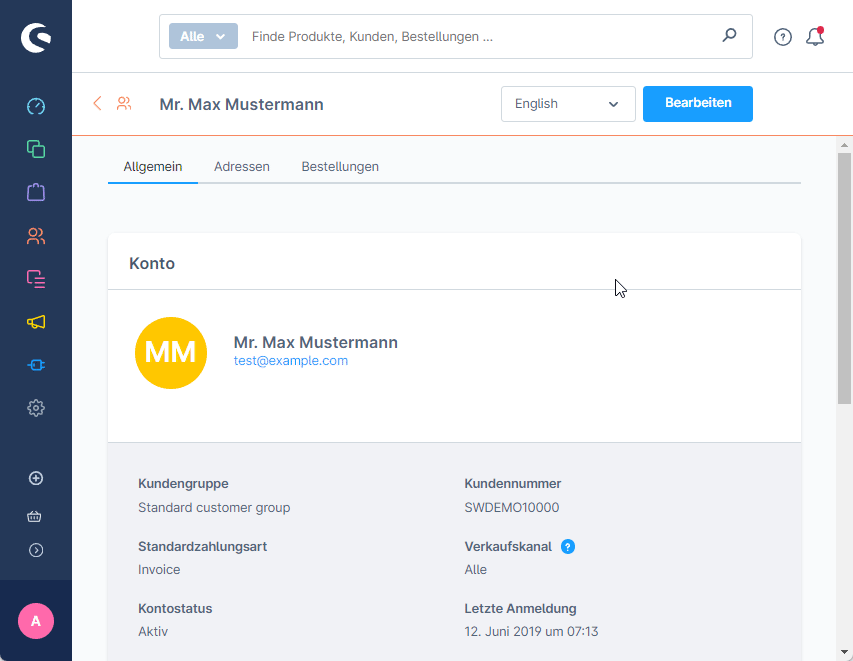
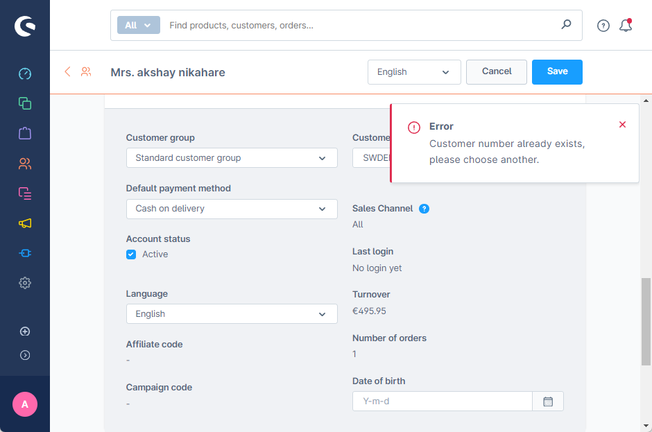

# SloxChangeCustomerNumber

SloxChangeCustomerNumber is a Shopware 6 plugin . The plugin allows you to Change Customer Number in admin. as shopware 6 does not provide this option by default 

## Installation

To install the SloxChangeCustomerNumber plugin, follow these steps:

1. Download the plugin ZIP file from the [releases](https://github.com/akshaynikhare/SloxChangeCustomerNumber/releases) page.
2. Extract the ZIP file to your Shopware 6 installation's custom/plugins directory.
3. Copy the extracted plugin folder to the `custom/plugins` directory of your Shopware 6 installation.
4. check for the folder name is should be `SloxChangeCustomerNumber`.
5. Log in to your Shopware 6 administration panel.
6. Go to the "Extension" >  "My Extensions" page.
7. Search for the "Download Installed plugin" plugin and click on the "Install" button.
8. Once the plugin is installed, click on the "Activate" button to enable it.

## Usage

After installing and activating the SloxChangeCustomerNumber plugin, you can see  download button under every plugin name.

## Development
If you want to contribute to the development of SloxMatomoEcomerce, follow these steps:

1. Clone the [SloxChangeCustomerNumber GitHub repository](https://github.com/akshaynikhare/sloxChangeCustomerNumber).
2. Ensure that you have Docker installed on your system.
3. Follow the instructions in the [Dockware documentation](https://docs.dockware.io/setup/docker-setup) to set up and run a Shopware development instance using Docker.
4. Once the containers are up and running, you can start making changes to the codebase and test your changes locally.

## Contributing

If you would like to contribute to the development of the SloxChangeCustomerNumber plugin, please follow these guidelines:

- Fork the repository and clone it to your local machine.
- Create a new branch for your changes.
- Make your changes and test them thoroughly.
- Commit your changes and push them to your forked repository.
- Submit a pull request with a detailed description of your changes.

We appreciate any contributions to the project!

## License

The SloxChangeCustomerNumber plugin is open source software licensed under the [MIT License](LICENSE).

## Support 
 
- For additional support, please email us at [info@cadnative.com](mailto:info@cadnative.com).
- or send us a contact requst at our website [cadnative.com](https://cadnative.com/contact/)